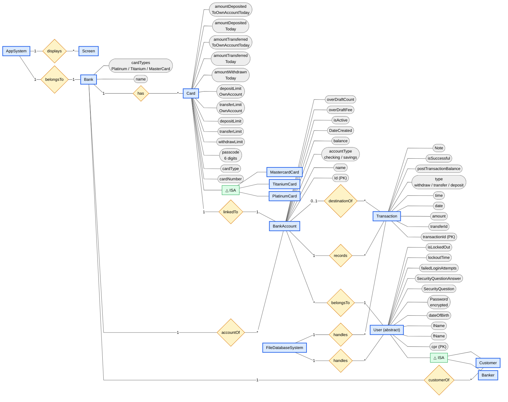
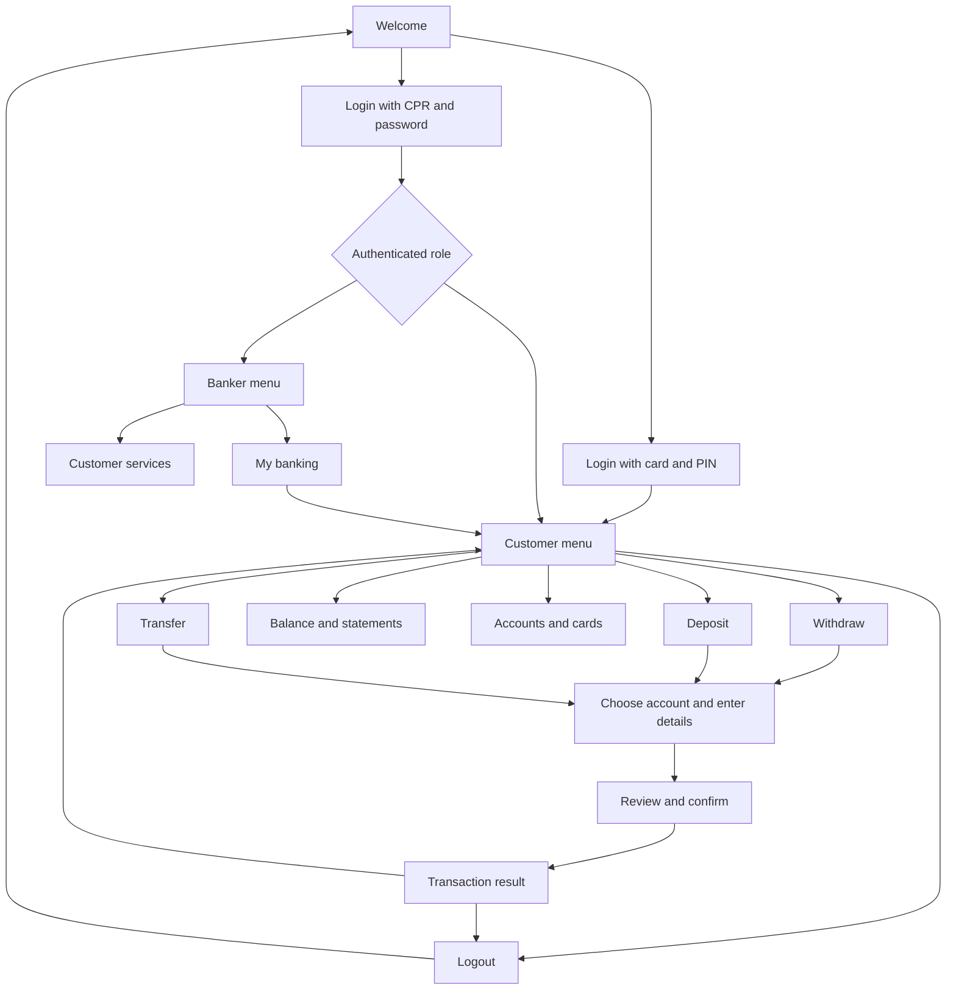

Entities:
---
* Bank
* BankAccount (checking/savings)
* Card (maybe make diff card types each a separate entity and child of this)
* PlatinumCard (child of Card)
* MastercardCard (child of Card)
* TitaniumCard (child of Card)
* User (abstract)
* Banker (child of User)
* Customer (child of User)
* Transaction
* AppSystem
* Screen
* FileDatabaseSystem

Relationship:
---
* Bank 1 (customerOf) * Customer
* Bank 1 (accountOf) * BankAccounts
* Bank 1 (has) * Card
* Card 1 (linkedTo) 1 BankAccount
* BankAccount * (belongsTo) 1 Person
* Banker [isA] Person
* Customer [isA] Person
* PlatinumCard [isA] Card
* TitaniumCard [isA] Card
* MastercardCard [isA] Card
* AppsSystem 1 (belongsTo) 1 Bank
* AppSystem 1 (displays) * Screen
* FileDatabaseSystem 1 (handles) * Person
* FileDatabaseSystem 1 (handles) * Transaction

--------------------------------------------------------------------------------

Attributes:
--
* Bank:
    * name
    * cardTypes (Platinum, Titanium, MasterCard) (thinking about removing them)
* Person
    * fName
    * lName
    * dateOfBirth
    * cpr
    * Password (encrypted)
    * SecurityQuestion
    * SecurityQuestionAnswer
    * failedLoginAttempts
    * lockoutTime
    * isLockedOut
* BankAccount
    * Id (maybe uuid)
    * name
    * balance
    * DateCreated
    * isActive
    * overDraftFee
    * overDraftCount
* Transaction
    * transactionId (uuid) 
    * transferId (common for both sender and receiver)
    * amount
    * date
    * time
    * type (withdraw, transfer, deposit)
    * toAccountId
    * postTransactionBalance
    * isSuccessful (did it go through or not)
    * Note (if it failed show why, if successful do something else)
* Card
    * cardType
    * cardNumber
    * passcode (6 digits)
    * withdrawLimit
    * transferLimit
    * depositLimit
    * transferLimitOwnAccount
    * depositLimitOwnAccount
    * amountWithdrawnToday
    * amountTransferredToday
    * amountTransferredToOwnAccountToday
    * amountDepositedToday
    * amountDepositedToOwnAccountToday
* AppSystem
    * bank
    * bankaccounts
    * isLoggedIn
    * user
    * currentPage
    * currentBankAccount
--------------------------------------------------------------------------------

ERD Diagram:
---

--------------------------------------------------------------------------------
Dir Structure:
--
* in one dir called peopleAndAccount
* one file for customers cpr and maybe name and associated bankAccounts ids and maybe type
* same things for bankers
* in another dir called peopleTransactions has 2 dir, customersTransactions and bankersTransactions.
* in each one it has the cpr as the dir for each person eg. `Banker-<BankerName>-<BankerCpr>`
* in each dir it has a dir titled the year it was created at, and inside another dir for month.
* inside the month dir is a file containing all the transaction in that year,month for that person.
* create a universal cprsAndAccountsAndCards file database in usersAndAccounts dir listing all users and their accounts and cards.

--------------------------------------------------------------------------------
addUserToCprsAndAccountsAndCardsFile structure:
---
Each user occupies one line:
cpr,hashedPassword,fName,role,lName,dateOfBirth,securityQuestion,hashedSecurityQuestionAnswer,failedLoginAttempts,lockoutTimeInMin,isLockedOut

Each bank account is appended with a comma:
,#bankAccountName:NAME#bankAccountType:TYPE

If the account has a card, its details follow within that same account field:
#cardNumber:NUMBER#cardType:TYPE#hashedCode:HASH

Example with two accounts, one with a card:
040206343,passwordHash,Saud,BANKER,Salah,2004-02-06,Your security question?,answerHash,0,1,false,#bankAccountName:saudMain#bankAccountType:SAVINGS#cardNumber:1234567890123456#cardType:PLATINUMCARD#hashedCode:codeHash,#bankAccountName:saudChecking#bankAccountType:CHECKING

The user fields occupy indexes 0–10; accounts begin at index 11 when splitting the line by commas.

--------------------------------------------------------------------------------

User Flow:
---

REVIEW TRANSFER

From:       Savings ••••1234
To:         Checking ••••5678
Amount:     $150.00
Balance after transfer: $850.00

1. Confirm transfer
2. Edit amount
0. Cancel
--------------------------------------------------------------------------------

User Stories
---
* as a user, I should be able to login with my credentials and use the system services.
* as a user, I should be able to navigate through the system menu.
* as a logged-in user, I should be able to transfer money to any account.
* as a logged-in user, I should be able to deposit money to my accounts or other peoples account.
* as a logged-in user, I should be able to withdraw money from my accounts.
* as a logged-in user, I should be able to open new accounts/cards.
* as a logged-in user, I should be able to filter transactions.
* as a logged-in user, I should be able to get a detailed account statement.
* as a customer, I should be able to login to my account using my card and passcode.
* as a banker, I should be able to add new customers.
* as a banker, I should be able to reactivate bank accounts. (bonus)
* as a banker, I should be able to reset overdraft counts. (bonus)
* as a banker, I should be able to wave overdraft fees. (bonus)
* as a system, I should be able to authenticate the user credentials against the database.
* as a system, I should be able to display different menus and services against different user roles.
* as a system, I should be able to charge overdraft fee of $35.
* as a system, I should be able to deactivate accounts after 2 overdrafts.
* as a system, I should be able to reactivate accounts after the customer resolves the negative balance.
* as a system, I should be able to detect fraud detection (3 failed login attempts) and lock the account for a time.
* as a system, I should be able to prevent logged-in users from withdrawing more than $100 if the account balance is negative.
* as a system, I should be able to limit bank accounts to one card per account.
* as a system, I should be able to display transaction data after the user finishes a transaction.

--------------------------------------------------------------------------------

Question: 
---
* for transactions, specifically Transfers, why does the limit depend on the card
when i can transfer money without a card?
you still have a card I guess or to the person you are transferring to. 

* is there a limit to the number of accounts a person can have? 
if yes does the type(checking/savings) matter?
no limit

* is there any difference between savings and checking account?
No diff.

* what is the difference between a Customer and a Banker?
a banker has more option than a customer in addition to what the customer can do.
so a banker can create a bank account for a customer, do transaction, etc...

* should customers with deactivated bank accounts be able to deposit and receive money
to their deactivated bank account?
 Yes, but the money will go directly to resolve the negative balance. They also
 won't be able to transfer or withdraw money till the account is reactivated.
 Other functionalities will remain the same.

--------------------------------------------------------------------------------

Notes:
---
* Security questions are inputted by users with the answers when creating account.
they are used when user forget the password so that he can reset the password.

* users choose option by inputting the corresponding number.

* each bank account has its own transactions table.

* think about different databases, and how their managed in the directory
* one database for customers that contain just basic info and other for bankers
* diff dir for each person and each account has a transactions file

* if user is locked out when he attempts to login in, check if lockout time has passed
if yes, change to not locked and allow him entry, otherwise reject.

* inactive accounts should still accept deposits to settle overdrafts and reactivate
  the account

* maybe use enums for account and transaction types

* bankers alone can add customers but customers can open bank accounts and cards.

* maybe in the future make it so when a banker adds a new customer, make the default password
  his password is his cpr, and the customer then has to reset his password. (bonus)

* a better approaches for storing users info would be a <CPR-Role>.properties file for each user instead of cprsAndAccountsAndCards.txt file that has all users data. but im too far in to change that now.

* create boolean updateUserInFile(User user) that updates the user values stored in cprsAndAccountsAndCards.txt file. note that cpr is not editable.

* for future: create a deleteUserFromFile deleteBankAccountFromFile deleteCardFromFile and etc...
--------------------------------------------------------------------------------

AI Usage:
---
* Used to write the mermaid code for the ERD diagram, input was the section 
before the ERD diagram.
* used to check weather my system design missed anything in the Technical Requirements.
* Generated the static generateRandom12DigitCardNumber method in Card class.
* fixed addUserToCprsAndAccountsAndCardsFile method to store the full user fields
--------------------------------------------------------------------------------

Tools Used:
---
* ChatGPT
* Gemini
* Draw.io
* Trello: https://trello.com/invite/b/6aa1071730cdd15389147058/ATTI975a2d4eb1aecc2fa34faa77848806daC149C793/banking-app
